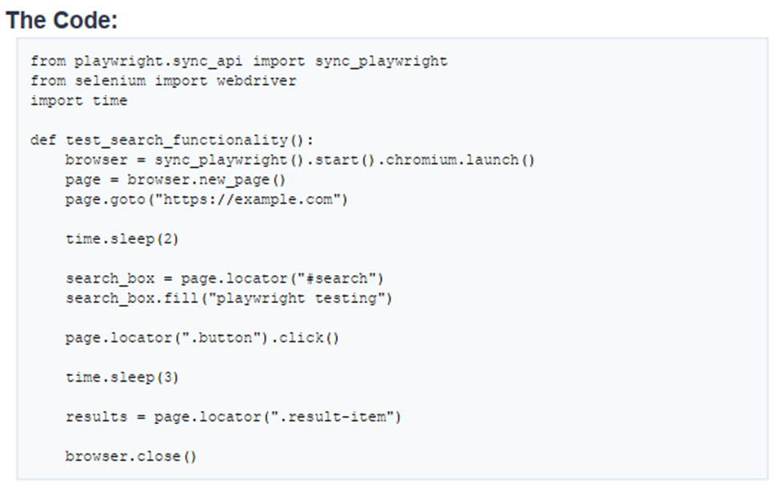

# ReadMeAIBugs

## Overview
Given The following code, which contains few error/issues.

Below are few identified issues along with their explanations and proposed fixes. 



---

## Issue 1: Mixing Playwright and Selenium

### Problem

```python
from selenium import webdriver
```
Selenium is imported but never used, while Playwright is used for browser automation.
This is also an unnecessary dependency.

### Fix

```python
# Remove this line
from selenium import webdriver
```
Also uninstall the selenium package, as well as remove from requirements.txt if it is listed there.

---

## Issue 2: Not using Context Manager for Playwright Initialization

### Problem

```python
sync_playwright().start()
```

Should use context manager (`with`) to ensure proper resource management and cleanup.

### Fix

```python
with sync_playwright() as p:
    browser = p.chromium.launch()
```

---

## Issue 3: No Use of pytest Fixtures for Initialization

### Problem

```python
browser = sync_playwright().start().chromium.launch()
```
Playwright should not be initialized inside the test, it is not part of test.

Additionally, in this way, the same logic will be repeated across all tests, which is not maintainable and scalable.

### Fix (Use pytest fixtures)

Move setup to `conftest.py`:

```python
import pytest
from playwright.sync_api import sync_playwright

@pytest.fixture(scope="session")
def browser():
    with sync_playwright() as p:
        browser = p.chromium.launch(headless=False)
        yield browser
        browser.close()

@pytest.fixture
def page(browser):
    context = browser.new_context()
    page = context.new_page()
    yield page
    context.close()
```

---

## Issue 4: Use of `time.sleep()` Instead of Playwright's Smart Waits

### Problem

```python
time.sleep(2)
```

Hard coded delays are: slow, flaky, and environment dependent. They can lead to unreliable tests.

### Fix

```python
page.wait_for_selector("#search")
page.wait_for_selector(".result-item")
```

---

## Issue 5: Missing Test Assertions

### Problem

```python
results = page.locator(".result-item")
```

The test retrieves results but does not validate them, actually, the test will pass even if no results are found, which makes it meaningless.

### Fix

```python
assert results.count() > 0, "No results found"
```

---

## Issue 6: Locators are Too Generic

### Problem

```python
page.locator(".button")
```
The locator is too generic, it may match multiple elements, which can lead to flaky tests if the page structure changes or if there are multiple buttons on the page.

### Fix

```python
page.locator("button[type='submit']")
```

---

## Issue 7: Repeated Inline Locators (No POM Usage)

### Problem

```python
page.locator("#search").fill("text")
page.locator("#search").click()
```

Since no POM is used, locators are repeated across the test code, which cause duplication and maintenance issues.

### Fix: Use Page Object Model (POM)

#### 📁 search_page.py

```python
class SearchPage:
    SEARCH_INPUT = "#search"
    SEARCH_BUTTON = "button[type='submit']"
    RESULTS = ".result-item"

    def __init__(self, page):
        self.page = page

    def navigate(self):
        self.page.goto("https://example.com")

    def search(self, text):
        self.page.locator(self.SEARCH_INPUT).fill(text)
        self.page.locator(self.SEARCH_BUTTON).click()

    def get_results(self):
        return self.page.locator(self.RESULTS)
```

---

## Issue 8: Missing Headless Configuration (Debugging Limitation)

### Problem

```python
browser = p.chromium.launch()
```

Runs in headless mode by default, which is good for CI but makes it hard to debug tests locally when something goes wrong, as you won't see the browser actions.

### Fix

```python
browser = p.chromium.launch(headless=False)
```

---

## Final Files After Fixes

### conftest.py
```python
import pytest
from playwright.sync_api import sync_playwright

@pytest.fixture(scope="session")
def browser():
    with sync_playwright() as p:
        browser = p.chromium.launch(headless=False)
        yield browser
        browser.close()

@pytest.fixture
def page(browser):
    context = browser.new_context()
    page = context.new_page()
    yield page
    context.close()
```
---
### test_search_functionality.py
```python
from pages.search_page import SearchPage

def test_search_functionality(page):
    search_page = SearchPage(page)

    search_page.navigate()
    search_page.search("playwright testing")

    results = search_page.get_results()

    assert results.count() > 0, "No results found"
```
---
### search_page.py
```python
class SearchPage:
    SEARCH_INPUT = "#search"
    SEARCH_BUTTON = "button[type='submit']"
    RESULTS = ".result-item"

    def __init__(self, page):
        self.page = page

    def navigate(self):
        self.page.goto("https://example.com")

    def search(self, text):
        self.page.locator(self.SEARCH_INPUT).fill(text)
        self.page.locator(self.SEARCH_BUTTON).click()

    def get_results(self):
        return self.page.locator(self.RESULTS)
```

---
